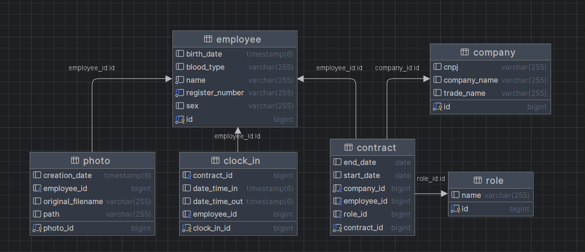
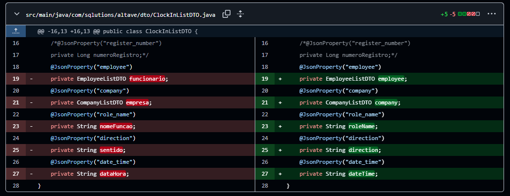
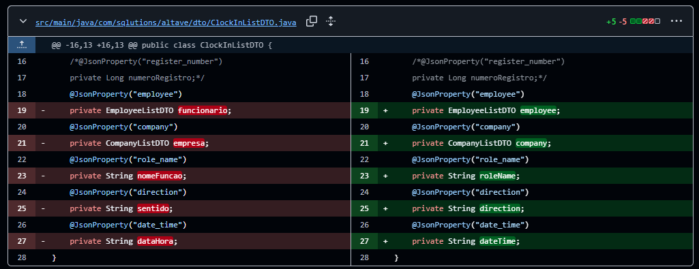
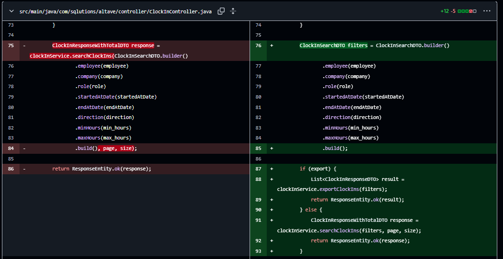

# Tiago Torres dos Reis

## Introdução

Olá! Sou estudante no curso de Banco de Dados da FATEC, da turma de 2024 - 1º semestre.

Sempre tive afinidade com a área de exatas. Em 2002, concluí um curso técnico de dois anos em Mecânica de Usinagem pelo SENAI. Logo depois, em 2004, finalizei também o curso técnico em Eletrônica, aprofundando ainda mais meu interesse por áreas técnicas e analíticas.

Mais recentemente, decidi fazer uma transição de carreira para a área de tecnologia, motivado por um convite e incentivo de um familiar que atua como profissional sênior em uma grande empresa do setor. Durante esse período de aprendizado, iniciei meus estudos em desenvolvimento web, adquirindo conhecimentos em HTML, CSS e Python. Desde então, venho me dedicando à evolução contínua nessa nova área, com foco em ampliar minhas habilidades e atuar profissionalmente com desenvolvimento de software.

## Minha Foto

 

## Meus Principais Conhecimentos

**Desenvolvimento Web Back-end:** Conhecimento básico, com experiência prática em projetos utilizando principalmente Spring Boot. 
**Banco de Dados:** Conhecimento em banco relacionais, principalmente postgres e MySQL.

## Meus Projetos

### Em 2025-1

No primeiro semestre de 2025, participei do desenvolvimento de um sistema de controle de ponto em equipe, com foco no registro das movimentações dos funcionários. A aplicação foi projetada para registrar horários de entrada e saída, calcular o total de horas trabalhadas e apresentar essas informações por meio de dashboards interativos e relatórios gerenciais.

- **Parceria Acadêmica**: Este projeto foi desenvolvido como parte das atividades acadêmicas da FATEC, em colaboração com a empresa Altave.

- **Desafio Identificado**: A empresa parceira precisava de uma ferramenta eficiente para monitorar possíveis atrasos de funcionários de prestadoras de serviço terceirizadas, com o objetivo de minimizar impactos negativos e prejuízos operacionais.

- **Solução Desenvolvida**: Criamos uma aplicação web capaz de consumir dados de um banco de dados externo, exibindo as informações de entrada e saída dos colaboradores. O sistema permite aplicar diversos filtros, visualizar gráficos e gerar relatórios personalizados, facilitando a análise e a tomada de decisões pela gestão da empresa.

#### Repositório do Projeto

[Acesse o repositório no GitHub](https://github.com/SQLutions-FATEC/API-3-Semestre)

## Tecnologias Utilizadas

- **PostgreSQL**: Utilizado como banco de dados relacional principal para armazenar informações estruturadas. Foram criadas tabelas normalizadas, com uso de índices para otimizar consultas e triggers para manter a integridade dos dados.

- **Docker**: Empregado para containerizar a aplicação, permitindo ambientes isolados para cada serviço (crawler, API e banco de dados). O uso do `docker-compose` facilitou a orquestração e a reprodução do ambiente em diferentes sistemas.

- **Java 21**: Linguagem utilizada no desenvolvimento do backend, com foco em princípios de orientação a objetos e práticas modernas da linguagem.

- **Spring Boot**: Framework utilizado para a construção da API RESTful, com uso do Spring Data JPA para integração com o banco de dados PostgreSQL por meio de mapeamento objeto-relacional.

- **Maven**: Ferramenta de gerenciamento de dependências e automação de build, utilizada para integrar bibliotecas como Spring Boot e Jsoup, além de configurar diferentes perfis de ambiente (desenvolvimento e produção).

- **Vue.js**: Framework JavaScript adotado no desenvolvimento do frontend, permitindo a criação de interfaces interativas e dinâmicas de forma eficiente.

## Contribuições Pessoais

  
Modelagem inicial do banco de dados

 
Em conjunto com os demais membros do grupo, definimos a estrutura inicial do banco de dados, incluindo suas tabelas e relacionamentos. O foco foi criar um esquema que atendesse aos fluxos prioritários mapeados, com uma abordagem de visibilidade limitada a longo prazo. Para garantir a coerência e facilitar as alterações, elaboramos um dump do banco que é inicializado junto ao Docker, minimizando assim os conflitos decorrentes de futuras modificações em relacionamentos, tabelas ou na adição de novos componentes.

  
Desenvolvimento back-end utilizando SpringBoot

Minha contribuição durante o desenvolvimento incluiu a refatoração pontual do código, meu objetivo era visar a otimização e a manutenibilidade. Intensifiquei esse trabalho nas semanas finais, próximo à entrega, focando nos seguintes pontos de melhoria:

  

    
Estruturação de dados (DTO)

Definição e implementação de DTOs (Data Transfer Objects) para organizar e otimizar a transferência de dados entre as camadas da aplicação.

  

  

    
Padronização de Código

Estabelecimento de padrões de código para garantir consistência, legibilidade e manutenção eficiente do projeto.

  

  
Endpoint para exportações em Larga Escala 

  
  Criação de endpoints para ignorar a paginação e trazer todos os dados do banco.

  
  

## Hard Skills

- **Java e Orientação a Objetos**: Domínio básico no desenvolvimento com Java, utilizando conceitos fundamentais de orientação a objetos e boas práticas como os princípios SOLID. Experiência inicial na criação de soluções simples, com uso de estruturas como coleções, tratamento de exceções, lambdas e streams.

- **PostgreSQL**: Conhecimento básico em modelagem de bancos de dados relacionais, com experiência na criação de tabelas, consultas SQL e entendimento dos fundamentos de integridade e desempenho em ambientes de desenvolvimento.

- **Scrum Master**: Atuei como Scrum Master em projeto acadêmico, facilitando cerimônias ágeis (como daily meetings, reviews e retrospectives), promovendo a comunicação entre os membros do time e auxiliando na remoção de impedimentos para garantir o andamento contínuo do projeto.

## Soft Skills

- **Organização e gerenciamento de tempo**: Como Scrum Master do projeto, eu era responsável por acompanhar e gerenciar o desenvolvimento da equipe. Para isso, utilizávamos o JIRA como ferramenta central de organização. Eu mantinha um cronograma com metas semanais e monitorava o andamento das tarefas por meio do gráfico de burndown, o que ajudava a visualizar o progresso do time e a identificar possíveis gargalos. Essa gestão foi essencial para garantir entregas dentro do prazo, mesmo durante períodos com múltiplas demandas acadêmicas.

- **Empatia**: Durante o projeto, percebi que alguns membros da equipe estavam com dificuldade para avançar em determinadas tarefas. Para ajudar, propus sessões de *peer programming*, o que nos permitiu resolver bloqueios técnicos de forma colaborativa e mais rápida. Também organizei reuniões rápidas para replanejar tarefas e garantir o alinhamento com os objetivos da sprint — essas reuniões aconteceram tanto presencialmente, no ambiente da faculdade, quanto remotamente, por meio do Discord, de acordo com a disponibilidade da equipe.

- **Colaboração**: Mantive uma postura aberta para escutar as ideias de todos, incentivando um ambiente de respeito e diálogo constante. Em momentos de desacordo técnico, ajudei a transformar divergências em aprendizados coletivos, promovendo decisões em conjunto e valorizando diferentes perspectivas. Quando o cliente não respondia no Slack, busquei orientação com o professor M2, que me aconselhou a envolver a professora P2 para destravar a equipe, garantindo que o fluxo do projeto não fosse prejudicado.

