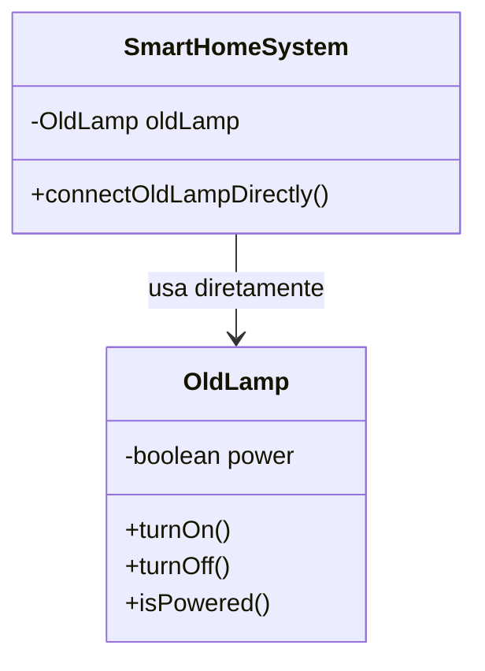

```mermaid
classDiagram
    class SmartHomeSystem {
        -OldLamp oldLamp
        +connectOldLampDirectly()
    }

    class OldLamp {
        -boolean power
        +turnOn()
        +turnOff()
        +isPowered()
    }

    %% Relação direta (acoplamento forte)
    SmartHomeSystem --> OldLamp : usa diretamente
```
