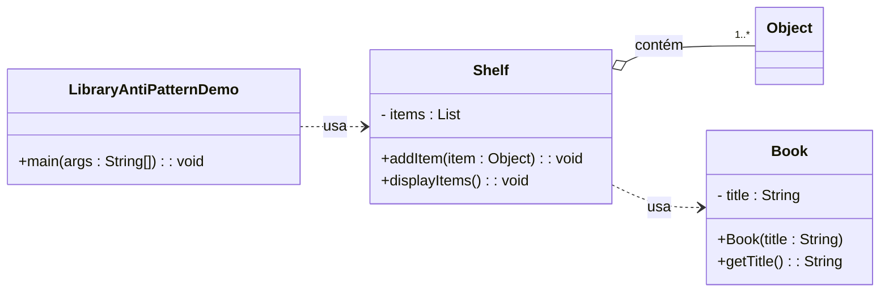

```mermaid
classDiagram
    direction LR

    class Book {
        - title : String
        +Book(title : String)
        +getTitle() : String
    }

    class Shelf {
        - items : List<Object>
        +addItem(item : Object) : void
        +displayItems() : void
    }

    class LibraryAntiPatternDemo {
        +main(args : String[]) : void
    }

    %% Relações
    Shelf o-- "1..*" Object : contém
    Shelf ..> Book : usa
    LibraryAntiPatternDemo ..> Shelf : usa
```
