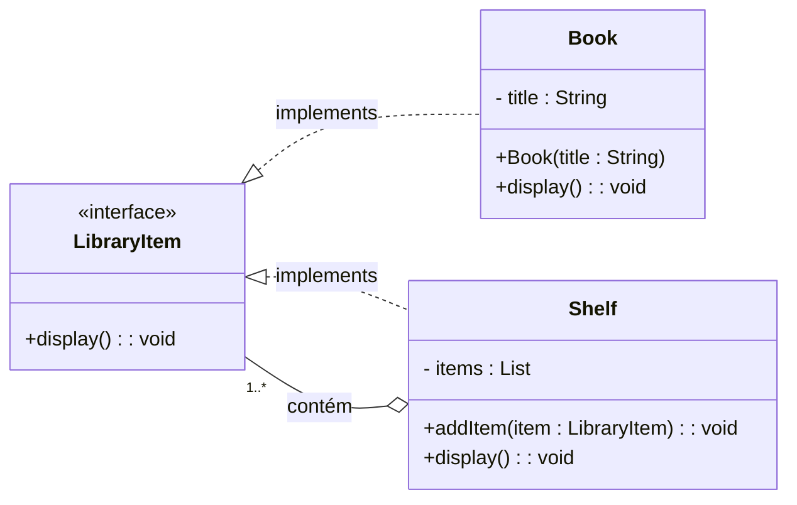

```mermaid
classDiagram
    direction LR

    class LibraryItem {
        <<interface>>
        +display() : void
    }

    class Book {
        - title : String
        +Book(title : String)
        +display() : void
    }

    class Shelf {
        - items : List<LibraryItem>
        +addItem(item : LibraryItem) : void
        +display() : void
    }

    %% Relações
    LibraryItem <|.. Book : implements
    LibraryItem <|.. Shelf : implements
    Shelf o-- "1..*" LibraryItem : contém
```
