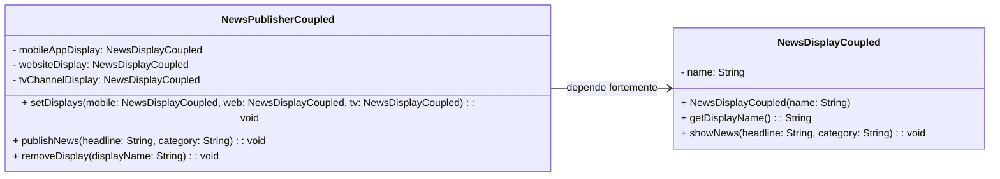

```mermaid
classDiagram
    direction LR

    class NewsPublisherCoupled {
        - mobileAppDisplay: NewsDisplayCoupled
        - websiteDisplay: NewsDisplayCoupled
        - tvChannelDisplay: NewsDisplayCoupled
        + setDisplays(mobile: NewsDisplayCoupled, web: NewsDisplayCoupled, tv: NewsDisplayCoupled): void
        + publishNews(headline: String, category: String): void
        + removeDisplay(displayName: String): void
    }

    class NewsDisplayCoupled {
        - name: String
        + NewsDisplayCoupled(name: String)
        + getDisplayName(): String
        + showNews(headline: String, category: String): void
    }

    %% Relações (acoplamento direto e fixo)
    NewsPublisherCoupled --> NewsDisplayCoupled : depende fortemente
```
