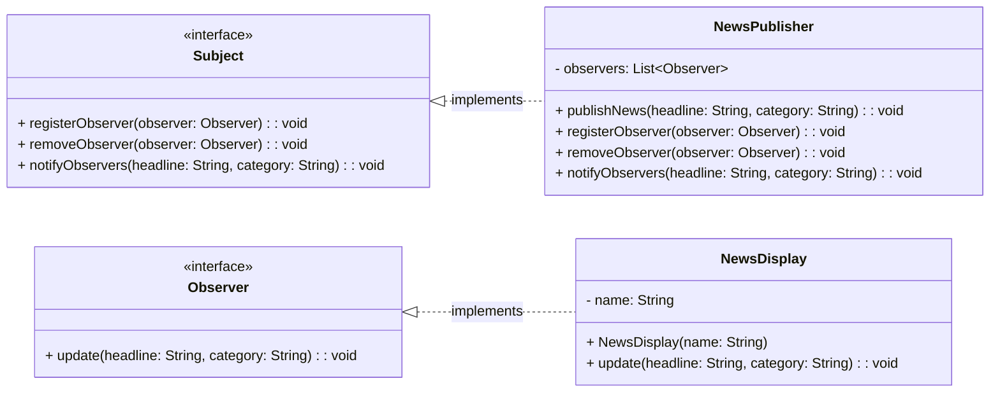

```mermaid
classDiagram
    direction LR

    %% Interfaces do Padrão
    class Subject {
        <<interface>>
        + registerObserver(observer: Observer): void
        + removeObserver(observer: Observer): void
        + notifyObservers(headline: String, category: String): void
    }

    class Observer {
        <<interface>>
        + update(headline: String, category: String): void
    }

    %% Implementações Concretas
    class NewsPublisher {
        - observers: List~Observer~
        + publishNews(headline: String, category: String): void
        + registerObserver(observer: Observer): void
        + removeObserver(observer: Observer): void
        + notifyObservers(headline: String, category: String): void
    }

    class NewsDisplay {
        - name: String
        + NewsDisplay(name: String)
        + update(headline: String, category: String): void
    }

    

    %% Relações do Padrão
    Subject <|.. NewsPublisher : implements
    Observer <|.. NewsDisplay : implements

    
```
