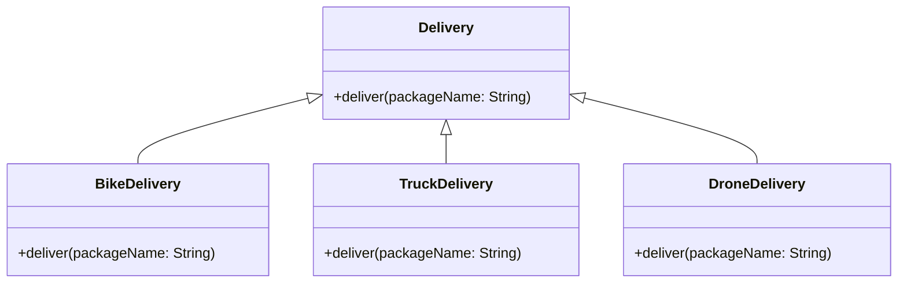

```mermaid
classDiagram
    direction TB

    class Delivery {
        +deliver(packageName: String)
    }

    class BikeDelivery {
        +deliver(packageName: String)
    }

    class TruckDelivery {
        +deliver(packageName: String)
    }

    class DroneDelivery {
        +deliver(packageName: String)
    }

    Delivery <|-- BikeDelivery
    Delivery <|-- TruckDelivery
    Delivery <|-- DroneDelivery
```
