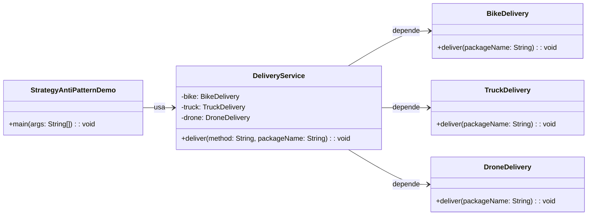

```mermaid
classDiagram
    direction LR

    class StrategyAntiPatternDemo {
        +main(args: String[]): void
    }

    class DeliveryService {
        -bike: BikeDelivery
        -truck: TruckDelivery
        -drone: DroneDelivery
        +deliver(method: String, packageName: String): void
    }

    class BikeDelivery {
        +deliver(packageName: String): void
    }

    class TruckDelivery {
        +deliver(packageName: String): void
    }

    class DroneDelivery {
        +deliver(packageName: String): void
    }

    StrategyAntiPatternDemo --> DeliveryService : usa
    DeliveryService --> BikeDelivery : depende
    DeliveryService --> TruckDelivery : depende
    DeliveryService --> DroneDelivery : depende

```
