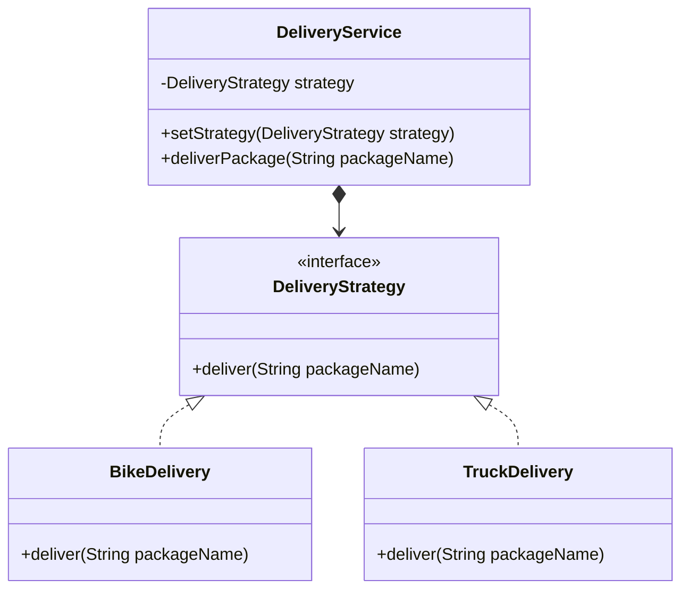

```mermaid
classDiagram
    class DeliveryStrategy {
        <<interface>>
        +deliver(String packageName)
    }

    class BikeDelivery {
        +deliver(String packageName)
    }

    class TruckDelivery {
        +deliver(String packageName)
    }

    class DeliveryService {
        -DeliveryStrategy strategy
        +setStrategy(DeliveryStrategy strategy)
        +deliverPackage(String packageName)
    }

    

    DeliveryService *-->DeliveryStrategy 
    DeliveryStrategy <|.. BikeDelivery
    DeliveryStrategy <|.. TruckDelivery
    
```
