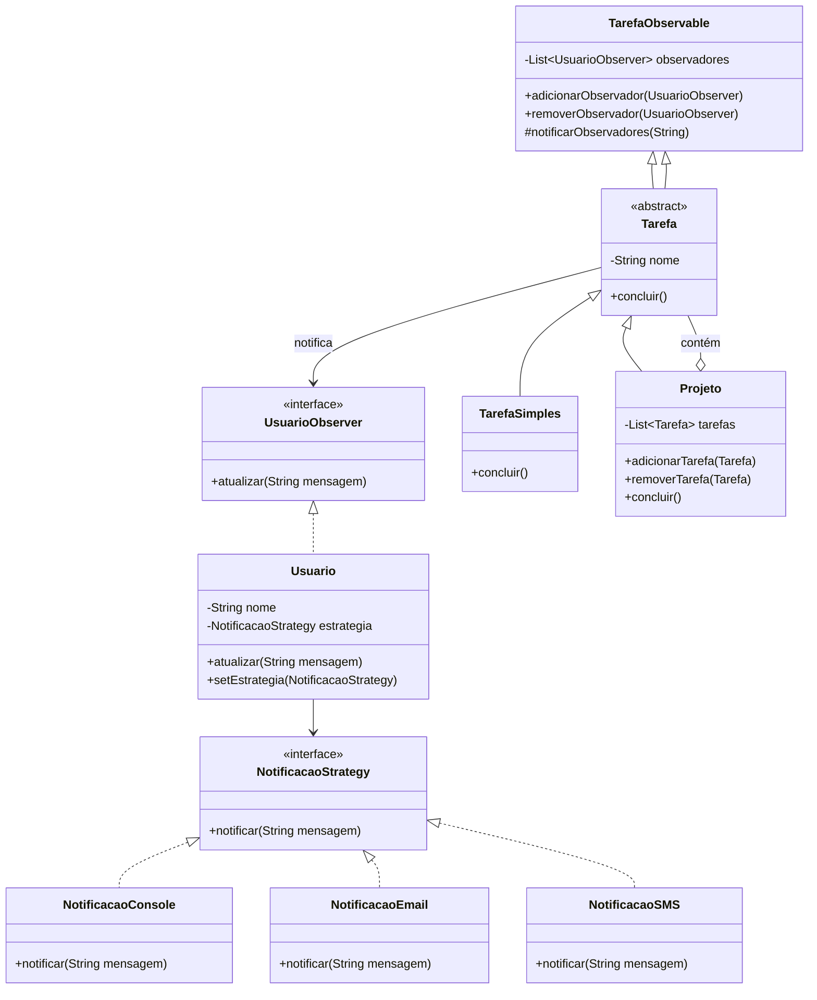

```mermaid
classDiagram
    %% ==========================
    %% Padrão Strategy
    %% ==========================
    class NotificacaoStrategy {
        <<interface>>
        +notificar(String mensagem)
    }

    class NotificacaoConsole {
        +notificar(String mensagem)
    }

    class NotificacaoEmail {
        +notificar(String mensagem)
    }

    class NotificacaoSMS {
        +notificar(String mensagem)
    }

    NotificacaoStrategy <|.. NotificacaoConsole
    NotificacaoStrategy <|.. NotificacaoEmail
    NotificacaoStrategy <|.. NotificacaoSMS

    %% ==========================
    %% Padrão Observer
    %% ==========================
    class UsuarioObserver {
        <<interface>>
        +atualizar(String mensagem)
    }

    class TarefaObservable {
        -List~UsuarioObserver~ observadores
        +adicionarObservador(UsuarioObserver)
        +removerObservador(UsuarioObserver)
        #notificarObservadores(String)
    }

    class Usuario {
        -String nome
        -NotificacaoStrategy estrategia
        +atualizar(String mensagem)
        +setEstrategia(NotificacaoStrategy)
    }

    UsuarioObserver <|.. Usuario
    TarefaObservable <|-- Tarefa
    Usuario --> NotificacaoStrategy

    %% ==========================
    %% Padrão Composite
    %% ==========================
    class Tarefa {
        <<abstract>>
        -String nome
        +concluir()
    }

    class TarefaSimples {
        +concluir()
    }

    class Projeto {
        -List~Tarefa~ tarefas
        +adicionarTarefa(Tarefa)
        +removerTarefa(Tarefa)
        +concluir()
    }

    Tarefa <|-- TarefaSimples
    Tarefa <|-- Projeto
    Projeto o-- Tarefa : contém

    %% ==========================
    %% Relacionamentos gerais
    %% ==========================
    TarefaObservable <|-- Tarefa
    Tarefa --> UsuarioObserver : notifica
```
